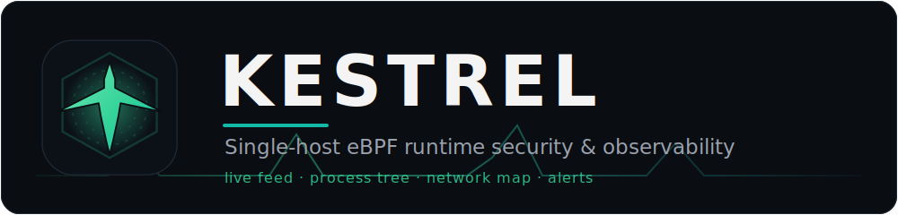
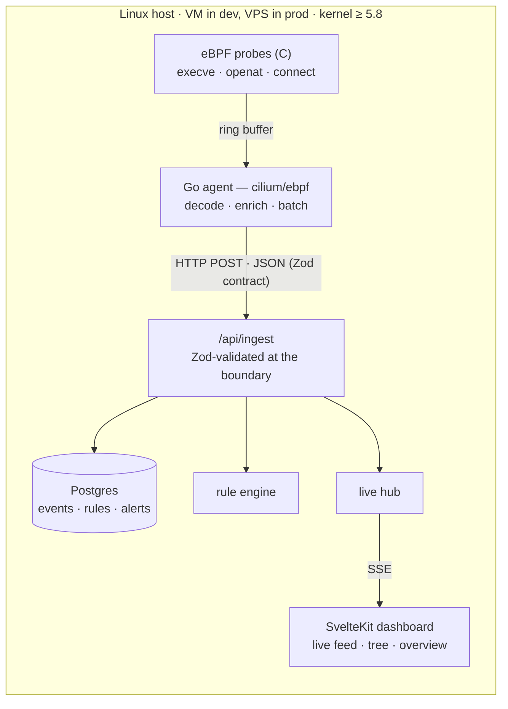

<div align="center">



<p><em>The kernel-level visibility of Falco, with the live UI the kernel-native tools don't ship.</em></p>


<a href="#running-the-app-dev"><b>Quickstart</b></a> ·
<a href="./SPEC.md"><b>Spec</b></a> ·
<a href="#dashboard-views"><b>Views</b></a> ·
<a href="#roadmap"><b>Roadmap</b></a>

</div>

Kestrel traces kernel events (process exec, file access, network connections)
with an **eBPF** agent and streams them to a **SvelteKit** web app that renders
a live activity feed, process tree, host overview, and a rule-based alert
engine. See [`SPEC.md`](./SPEC.md) for the full product/architecture document
and [`CLAUDE.md`](./CLAUDE.md) for the operational guide.

## Why it exists

The eBPF ecosystem is backend/CLI/Kubernetes-operator shaped. Falco — the
CNCF-graduated standard — famously ships **no UI of its own**. The gap between
"the kernel emits rich data" and "a human can actually read it" is the
full-stack sweet spot this project lives in. Deliberately **single-host** (not
Kubernetes) and **observe-only** (no enforcement) in v1.

## Architecture



**The key deployment constraint:** the agent needs a real kernel, so it
**cannot** run on Cloudflare Workers (V8 isolates, no kernel). v1 co-locates
agent + app + Postgres on one host. See `SPEC.md` §2.

## Repository layout

| Path | What |
|---|---|
| [`/app`](./app) | SvelteKit app — event schema, ingest, SSE hub, dashboard views. **Built & runnable.** |
| [`/agent`](./agent) | Go userspace agent + eBPF C probes. *Runs in the VM only.* (stub) |
| [`/infra`](./infra) | Nix dev VM + `nixosTest`, Terraform/libvirt provisioning. (stub) |
| [`SPEC.md`](./SPEC.md) | Authoritative product & architecture spec. |

## Status

**Phase 1 — core loop, app side complete and verified.** The full
ingest → DB → live-feed path runs in the browser today, driven by a synthetic
event source that stands in for the not-yet-built agent. The Go/eBPF agent is
next and must be developed inside the dev VM (never the host).

## Dashboard views

Depth on a few views beats breadth done shallowly — six crisp views, built in
priority order (must-haves first).

| View | The question it answers | Status |
|---|---|---|
| **Live activity feed** (8.1) | *What's happening right now?* | ✅ built |
| **Process tree** (8.2) | *What spawned what?* | ◻️ planned (must-have) |
| **Host overview** (8.6) | *One-screen status?* | ◻️ planned (must-have) |
| **Network map** (8.3) | *What is this host talking to?* | ◻️ planned |
| **Sensitive-file monitor** (8.4) | *Did anything touch the files that matter?* | ◻️ planned |
| **Alerts & rules** (8.5) | *Tell me when something looks sketchy.* | ◻️ planned |

## Roadmap

- [x] **Phase 1 (app):** event schema · ingest · SSE hub · live feed · tests
- [ ] **Phase 1 (agent):** `execve` probe → ring buffer → `cilium/ebpf` → `/api/ingest` *(in the VM)*
- [ ] **Phase 2:** process-tree cache + tree view + host overview
- [ ] **Phase 3:** file + connect probes · network map · file monitor · rule engine
- [ ] **Phase 4:** Nix dev VM · `nixosTest` kernel integration test · GitHub Actions CI
- [ ] **Phase 5:** VPS deploy (Terraform), agent + app + Postgres co-located
- [ ] **Phase 6 (stretch):** timeline/history · LLM "explain this alert" · enforcement · multi-host · k8s DaemonSet

## Running the app (dev)

```bash
cd app
pnpm install
pnpm dev            # http://localhost:5173 — live feed with synthetic events
```

A synthetic event generator is on by default in dev so the feed is alive
without the agent. Disable it with `KESTREL_SYNTHETIC=0`.

```bash
pnpm check          # svelte-check (types)
pnpm test           # vitest — schema + ingest unit tests
pnpm build          # production build (adapter-node)
```

The dev/test database is **PGlite** (Postgres compiled to WASM): no native
build, no separate server, same SQL dialect as the prod Postgres. It persists
to `app/kestrel-pgdata/` (gitignored); tests use an ephemeral in-memory DB.

### Try the pipeline by hand

```bash
# stream events (leave running in one terminal)
curl -N http://localhost:5173/api/stream

# post an event (in another) — appears live in the stream and the browser
curl -X POST http://localhost:5173/api/ingest -H 'content-type: application/json' \
  -d '[{"host":"demo","type":"exec","pid":42,"comm":"bash","cmdline":"bash -i"}]'
```

## Design tradeoffs

- **Single-host vs cluster** — deliberate scope choice; multi-host is a far
  stretch (`SPEC.md` §8.11).
- **Observe-only vs enforcement** — v1 never kills processes; the risk bar for
  inline blocking is much higher (`SPEC.md` §8.10).
- **`cilium/ebpf` vs `libbpfgo`** — pure Go, `CGO_ENABLED=0`, `bpf2go` workflow.
- **PGlite/Postgres vs SQLite vs ClickHouse** — Postgres dialect everywhere;
  fine under ~1M events, revisit ClickHouse beyond that (`SPEC.md` §10).
